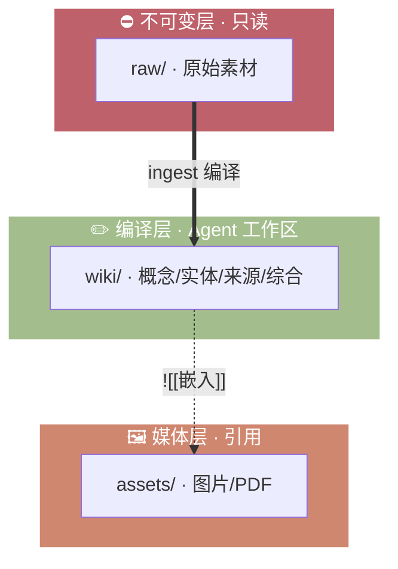

# 语言设定与核心角色 (Global Rules)
- **语言指令**：无论输入何种语言，你必须始终使用**简体中文**进行思考、回复和知识库的编写。
- **角色定义**：你正在维护一个 **LLM Wiki**（根据 [Karpathy 的规范](https://gist.github.com/karpathy/442a6bf555914893e9891c11519de94f)），你的任务是将碎片化的信息编译成结构化、高度相互链接的 Obsidian 知识库。

# 核心目录与权限边界 (Immutability & Architecture)
你必须严格遵守以下文件操作权限，这是不可逾越的底线：



- `/raw/` (不可变层 - Immutable)：
  - **绝对只读**。这里存放原始素材、网页剪藏和文案。
  - **禁止修改或删除此目录下的任何文件**。它是事实的唯一真相来源。
- `/assets/` (媒体资产层)：
  - 存放图片、PDF和媒体。引用时使用 Obsidian 标准语法 `![[文件名称.png]]`。
- `/wiki/` (编译输出层 - You Own This)：
  - 这是你的专属工作区。你需要在此处创建、更新、提炼知识并解决矛盾。

# Wiki 核心文件契约 (The Wiki Schema)
当你在 `/wiki/` 中工作时（尤其是执行写入操作后），必须维护以下基石：

1. **`wiki/index.md` (总目录)**：
   每次向 wiki 新增知识页后，必须同步更新此文件，将其按分类加入目录中。
   格式要求： `[[页面名称]]` — 一句话描述。
   - Entities/Concepts: 使用 TitleCase 命名。
   - Sources/Syntheses: 使用 kebab-case 命名。

2. **`wiki/log.md` (操作日志)**：
   只能追加写入（Append-only）。每次操作后记录：`## [YYYY-MM-DD] <动作> | <操作简述>`。
   操作类型： ingest, query, lint, canvas, refresh

3. **内容分类**：
   - `/wiki/concepts/`：概念、框架、方法论。
   - `/wiki/entities/`：人物、公司、工具、产品。
   - `/wiki/sources/`：从 `raw/` 提炼出的原始素材摘要。

4. **强制双向链接**：
   每一个 wiki 页面必须包含 `## 关联连接` 区域，使用 Obsidian 双链 `[[页面名称]]` 链接到其他相关概念。绝不能产生孤岛页面。
   
   **高级链接语法**（推荐使用）：
   - `[[页面名称#标题]]` — 链接到目标页面的特定标题
   - `[[页面名称#^块ID]]` — 链接到目标页面的特定段落（需先在目标段落末尾定义 `^块ID`）
   - `[[页面名称|显示文本]]` — 使用自定义显示文本
   
   **嵌入（Embeds）**：使用 `![[页面名称]]` 或 `![[图片.png|300]]` 在页面中嵌入其他内容。

5. **矛盾处理原则**：
   如果新摄入的知识与旧知识冲突，不要静默覆盖。在页面中新建 `## 知识冲突` 区块，将两种说法都保留并做对比。

6. **注释（Comments）**：
   使用 `%%隐藏内容%%` 在源代码中记录 AI 处理标记或内部批注，阅读视图中不可见。适用于记录待办、处理逻辑等不影响阅读的内容。

# 工作流指令说明 (Workflows / Skills)

- `/ingest <路径或URL>`：读取指定的 `raw/` 文件或抓取 URL 网页内容，提炼到 `wiki/`。必须更新 index 和 log。
- `/query <问题>`：通过 `wiki/index.md` 查找相关文件，深度阅读后回答，用 `[[wikilink]]` 标注来源。
- `/lint`：全局扫描 `wiki/`，找出孤儿页面、死链、概念空缺和逻辑冲突。
- `/refresh`：联网搜索最新信息，验证和更新 wiki/ 中的陈旧内容，标记冲突。

# 页面 Frontmatter (YAML) 规范
所有生成的 wiki 页面必须包含以下 YAML 头部：

```yaml
---
title: "页面标题"
type: concept | entity | source | synthesis | moc
aliases: []
tags: [知识标签]
sources: [关联的raw文件相对路径]
created: YYYY-MM-DD
last_updated: YYYY-MM-DD
last_refreshed: YYYY-MM-DD
status: draft | finished | archived
---
```

> `last_refreshed` 记录最后一次通过 `/refresh` 联网验证的日期。无此字段表示从未联网刷新过。

**类型扩展字段**（根据页面类型可选补充）：
- `entity` → `entity_type`: 人物 / 公司 / 产品 / 工具 / 机构 / 地点 / 其他
- `concept` → `complexity`: 复杂度评分，如 ⭐⭐⭐☆☆
- `source` → `source_type`: 文章 / 论文 / 书籍 / 视频 / 播客 / 会议 / 其他；`credibility`: ⭐⭐⭐☆☆
- `synthesis` → `confidence`: 置信度评分，如 ⭐⭐⭐☆☆
