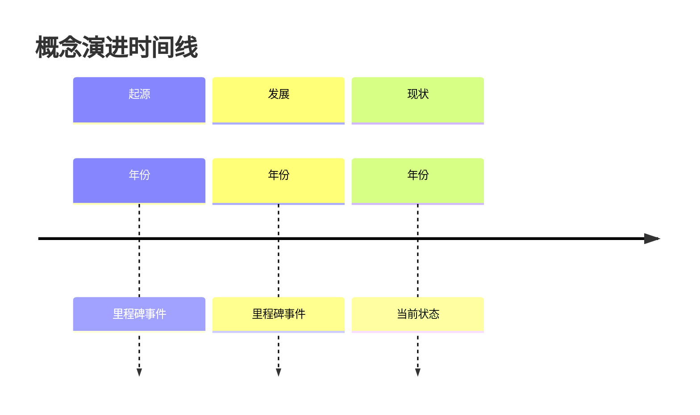

> **概念领域**: #待补充（技术 / 商业 / 科学 / 方法论 / 哲学 / 其他）
> **复杂度**: ⭐⭐⭐☆☆

## 一句话定义

用最通俗的语言，向一个外行解释这个概念是什么。

## 为什么重要

这个概念解决什么问题？为什么值得理解？

## 核心原理

### 关键要素
1. 
2. 
3. 

### 运作机制
- 

## 类比理解

用一个日常场景或已知的概念来类比，帮助理解：
> 就像 ... 一样，...

## 演进脉络

这个概念是如何发展起来的：

| 时间 | 里程碑 | 关键人物/来源 |
|------|--------|-------------|
|  | 概念提出 |  |
|  |  |  |
|  | 当前状态 |  |

也可用 Mermaid 时间线可视化：

## 常见误区

- **误区 1**: 
  - *正确理解*: 
- **误区 2**: 
  - *正确理解*: 

## 应用场景

| 场景 | 说明 |
|------|------|
|  |  |

## 延伸知识

### 前置概念（需要先了解）
- [[前置概念 A]]
- [[前置概念 B]]

### 相关概念（同级扩展）
- [[相关概念 A]]
- [[相关概念 B]]

### 下游概念（基于此发展）
- [[下游概念 A]]

## 关联连接

- [[相关实体]] — 关系描述
- [[来源文件]] — 信息来源

## 知识冲突

| 观点 A | 观点 B | 我的判断 |
|--------|--------|---------|
|  |  |  |

## 待深入

- [ ] 补充数学公式/形式化定义
- [ ] 补充历史演进脉络
- [ ] 添加具体案例
