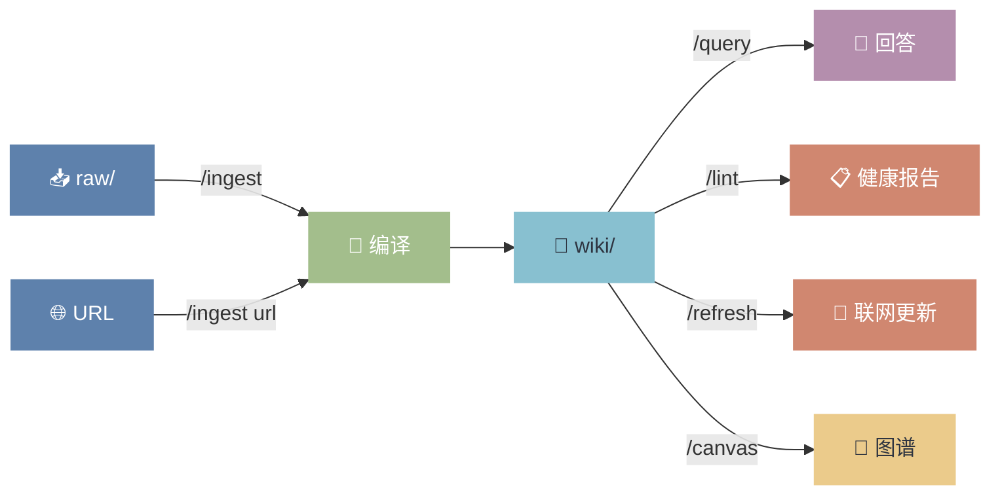

# Wiki Index

> 全局知识导航。本页面使用 Dataview 动态聚合，无需手动维护列表。
> 若 Dataview 插件未安装，以下查询块将显示为代码。

## 🗺️ 知识管线



---

## 📊 知识库概览

```dataview
TABLE WITHOUT ID
  "📄 " + length(file.inlinks) AS "被引用数",
  length(file.outlinks) AS "引用数",
  length(file.tags) AS "标签数",
  last_updated AS "最后更新"
FROM "wiki"
WHERE type != null
SORT last_updated DESC
LIMIT 10
```

---

## 📥 最新摄入的来源

```dataview
TABLE
  source_type AS "类型",
  credibility AS "可信度",
  last_updated AS "更新日期"
FROM "wiki/sources"
SORT created DESC
LIMIT 8
```

---

## 🧠 概念库

```dataview
TABLE
  complexity AS "复杂度",
  last_updated AS "更新日期",
  status AS "状态"
FROM "wiki/concepts"
SORT last_updated DESC
LIMIT 15
```

---

## 🏢 实体库

```dataview
TABLE
  entity_type AS "类型",
  last_updated AS "更新日期",
  status AS "状态"
FROM "wiki/entities"
SORT last_updated DESC
LIMIT 15
```

---

## 🔬 综合分析

```dataview
TABLE
  confidence AS "置信度",
  last_updated AS "更新日期",
  status AS "状态"
FROM "wiki/syntheses"
SORT last_updated DESC
LIMIT 10
```

---

## ⚠️ 待处理

### 草稿状态页面
```dataview
LIST
FROM "wiki"
WHERE status = "draft"
SORT last_updated DESC
```

### 无来源的页面（需补充溯源）
```dataview
LIST
FROM "wiki"
WHERE type != null
  AND (sources = null OR length(sources) = 0)
SORT file.name ASC
```

### 需要联网刷新（超过 90 天未刷新）
```dataview
LIST
FROM "wiki"
WHERE type != null
  AND last_refreshed != null
  AND date(last_refreshed) < date(today) - dur(90 days)
SORT last_refreshed ASC
```

### 从未联网刷新过
```dataview
LIST
FROM "wiki"
WHERE type != null
  AND last_refreshed = null
SORT file.name ASC
```

---

## 🗺️ 主题地图 (MOC)

按领域浏览知识：

- [[MOC-技术]] — 技术概念、工具、框架
- [[MOC-商业]] — 产品、市场、商业模式
- [[MOC-人物]] — 关键人物与机构
- [[MOC-待整理]] — 待分类的知识碎片

---

*本页面由 Dataview 自动维护。最后更新：`=date(now)`*
