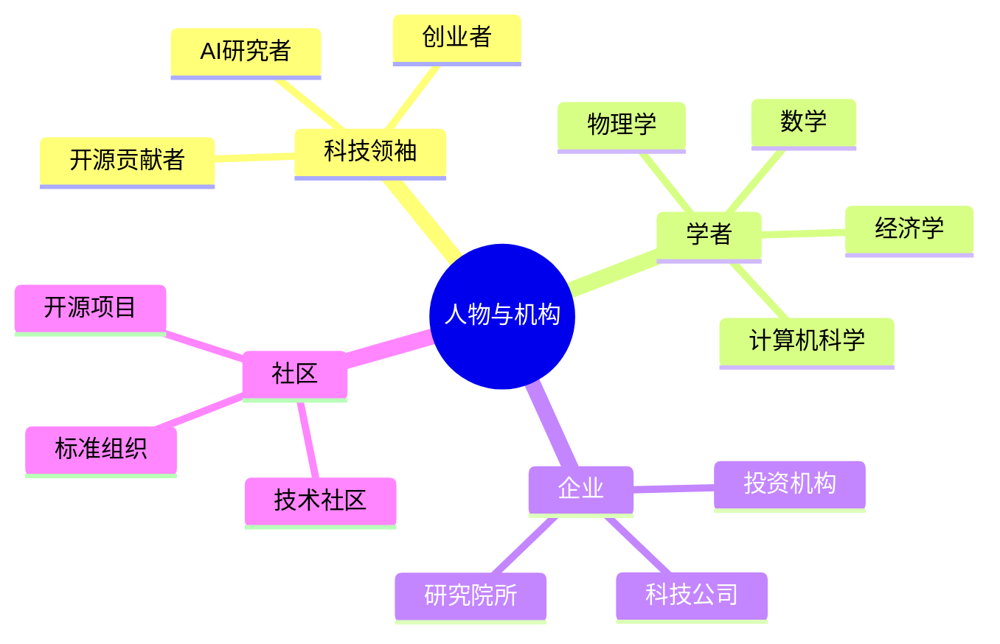

# MOC-人物

> 关键人物与机构的知识地图。

## 人物与机构图谱



## 人物

```dataview
TABLE entity_type AS "类型", last_updated AS "更新日期", status AS "状态"
FROM "wiki/entities"
WHERE entity_type = "人物" OR contains(tags, "#人物")
SORT last_updated DESC
```

## 公司与机构

```dataview
TABLE entity_type AS "类型", last_updated AS "更新日期", status AS "状态"
FROM "wiki/entities"
WHERE entity_type = "公司" OR entity_type = "机构" OR contains(tags, "#公司")
SORT last_updated DESC
```
