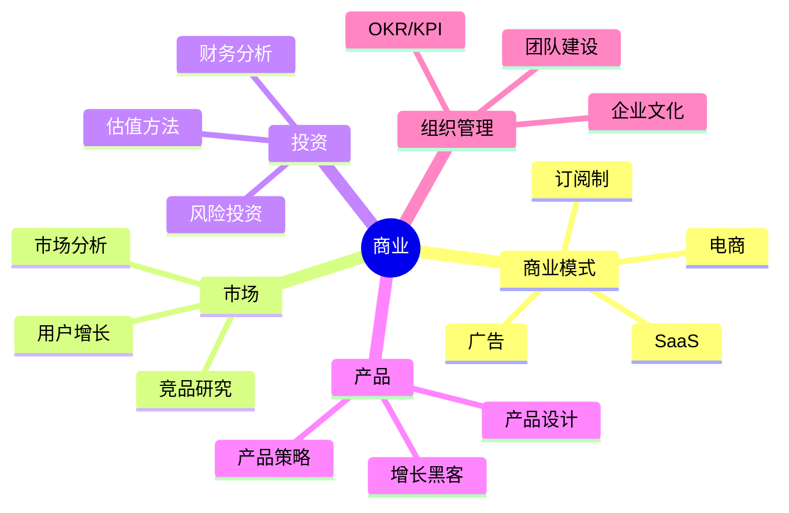

# MOC-商业

> 产品、市场、商业模式的知识地图。

## 商业领域图谱



## 概念

```dataview
TABLE complexity AS "复杂度", last_updated AS "更新日期", status AS "状态"
FROM "wiki/concepts"
WHERE contains(tags, "#商业") OR contains(tags, "#business")
SORT last_updated DESC
```

## 实体

```dataview
TABLE entity_type AS "类型", last_updated AS "更新日期", status AS "状态"
FROM "wiki/entities"
WHERE contains(tags, "#商业") OR contains(tags, "#business")
SORT last_updated DESC
```

## 综合分析

```dataview
TABLE confidence AS "置信度", last_updated AS "更新日期"
FROM "wiki/syntheses"
WHERE contains(tags, "#商业") OR contains(tags, "#business")
SORT last_updated DESC
```

> 💡 提示：给相关页面添加 `#商业` 或 `#business` 标签即可自动聚合到本 MOC。
