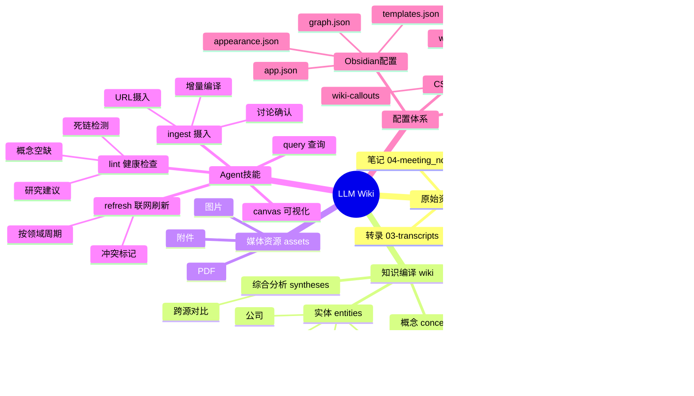
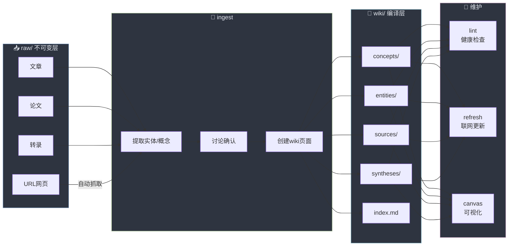
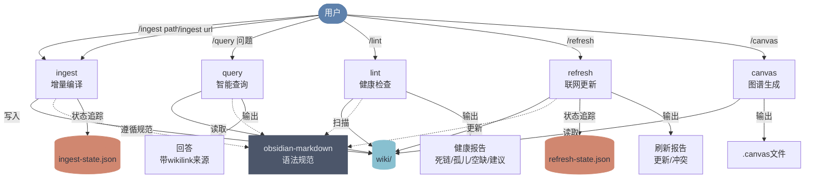
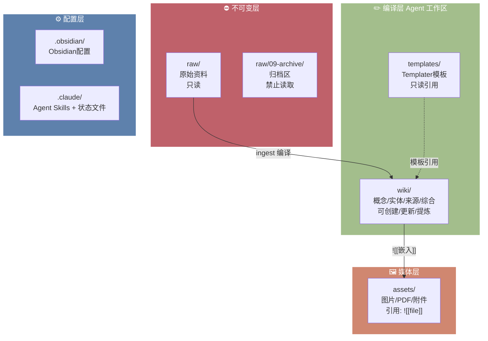

# 知识库全景

> [!tip] 关于本页面
> 以下思维导图使用 **Mermaid** 语法，Obsidian 原生支持，无需安装任何插件。
> 如同时安装了 Mindmap 插件，本页面的层级标题也可渲染为交互式思维导图。

## 架构总览

## 知识编译流程

## Agent 技能交互

## 目录权限模型

## 关联连接

- [[index]] — 全局内容字典
- [[log]] — 操作日志
- [[MOC-技术]] — 技术领域主题地图
- [[MOC-商业]] — 商业领域主题地图
- [[MOC-人物]] — 人物与机构主题地图
- [[MOC-待整理]] — 待分类与草稿
